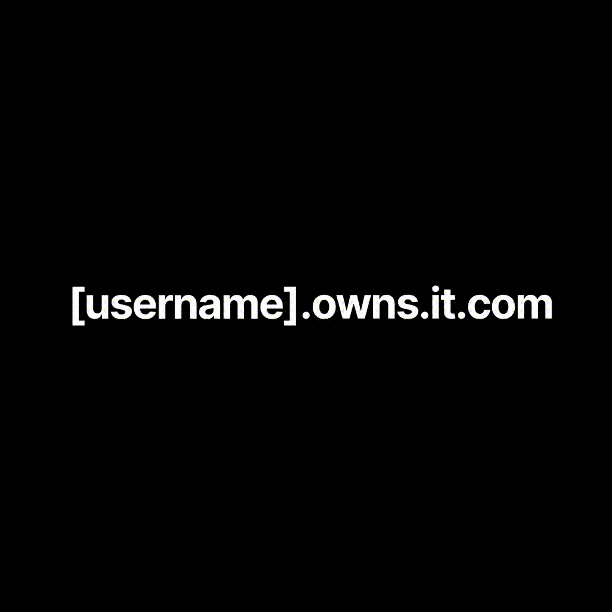

<p align="center">
  
</p>

## 📢 Announcements & Status Updates

Please join our Discord server for announcements, updates & upgrades, and downtime notifications regarding the service. While critical updates will be posted on GitHub, all announcements will be available in our Discord server.

<p align="center">
  <a href="https://discord.gg/jtVHRF9CdK">
    
  </a>
</p>

## 🌐 Available Domains

We offer the following domain for registration:

| Domain | Description |
|--------|-------------|
| `*.owns.it.com` | For showcasing your projects and personal sites |

> **Note**: Wildcard subdomains (e.g., `*.example.owns.it.com`) are available but require detailed justification.

## 🚀 How to Register

1. **Fork & Star**: Start by forking and starring this repository
2. **Create Domain File**: Add a new file `your-subdomain.domain.json` in the `/domains` folder
3. **Configure Domain**: Use this template (customize as needed):

```json
{
    "description": "Brief project description",
    "domain": "owns.it.com",
    "subdomain": "your-subdomain",
    
    "owner": {
        "repo": "https://github.com/username/repo",
        "email": "your@email.com"
    },
    
    "record": {
        "A": ["1.1.1.1"],
        "AAAA": ["::1"],
        "CNAME": "your-domain.com",
        "TXT": ["verification=123"]
    },
    
    "proxied": false
}
```

4. **Submit PR**: Create a pull request with your changes
5. **Wait for Review**: We'll review and merge your request (review times vary; join our [Discord](https://discord.gg/jtVHRF9CdK) and let us know about your PR to expedite the process)
6. **Domain Active**: Allow up to 24 hours for DNS propagation (typically 5-15 minutes)

## 🔧 Common Providers

We provide detailed setup guides for various hosting providers. All guides are available at [getyourfree.space/providers](https://getyourfree.space/providers/).

### Available Setup Guides

- [Cloudflare Pages](https://getyourfree.space/providers/cloudflare-pages) - Complete guide for setting up with Cloudflare Pages
- [Codeberg Pages](https://getyourfree.space/providers/codeberg-pages) - Guide for Codeberg Pages setup
- [DanBot Hosting](https://getyourfree.space/providers/danbot-hosting) - DanBot Hosting integration guide
- [Discord](https://getyourfree.space/providers/discord-domain) - Discord integration setup
- [GitHub Pages](https://getyourfree.space/providers/github-pages) - GitHub Pages configuration guide
- [Hashnode](https://getyourfree.space/providers/hashnode) - Hashnode setup instructions
- [ImprovMX](https://getyourfree.space/providers/improvmx) - Email forwarding with ImprovMX
- [Netlify](https://getyourfree.space/providers/netlify) - Netlify deployment guide
- [Railway](https://getyourfree.space/providers/railway) - Railway platform setup
- [Render](https://getyourfree.space/providers/render) - Render deployment instructions
- [Replit](https://getyourfree.space/providers/replit) - Replit integration guide
- [Vercel](https://getyourfree.space/providers/vercel) - Vercel deployment setup

Each guide provides detailed instructions for setting up your subdomain with the respective service. Choose your preferred platform and follow the corresponding guide for setup instructions.

## ⚙️ Domain Features

All our domains include:

- ✅ DNSSEC Protection
- ✅ Email Support
- ✅ Full SSL/TLS
- ✅ HTTPS Enforcement
- ✅ HSTS Security
- ✅ TLS 1.2+ Required
- ✅ WAF Protection
- ✅ Browser Integrity Checks


## 🔒 NS Records

When applying for NS records, please be aware that we already support a wide range of DNS records, so you may not need them. To request NS records:

1. **Explain Your Need**: In your PR, provide a detailed explanation of why you need NS records
2. **Provide Examples**: Include specific use cases and examples
3. **Follow Guidelines**: Review our FAQ for allowed usage guidelines

> **Note**: Pull requests for NS records without sufficient justification will be closed. However, donors automatically qualify for NS record access - see our Support section for details.

## ⚠️ Report Abuse

If you discover any subdomains being used for malicious purposes or violating our terms:

1. Create a GitHub issue with the title "Abuse Report: subdomain.owns.it.com"
2. Provide evidence of the abuse
3. Include any relevant timestamps and details

We take abuse reports seriously and will investigate promptly.

## 💝 Support Us

If you find this service valuable:

1. **Donate**: Support our infrastructure costs via [Stripe](https://dub.sh/sponsor-a-domain)
2. **Join**: Connect with us on [Discord](https://discord.gg/jtVHRF9CdK)
3. **Share**: Star and share this project

> **Special Note**: NS records are available exclusively for donors.

## ⚠️ Important Notes

- Reserved subdomains (www, api, admin, etc.) are not available
- Domains used for illegal purposes will be permanently banned
- Check `utils/reserved-subdomains.json` for the reserved list

## 📜 License

This project is licensed under the [MIT License](LICENSE).

---

<p align="left">Looking for similar services? Check out <a href="https://free.hrsn.dev/#/?id=domains">Free For Life</a>.</p>
